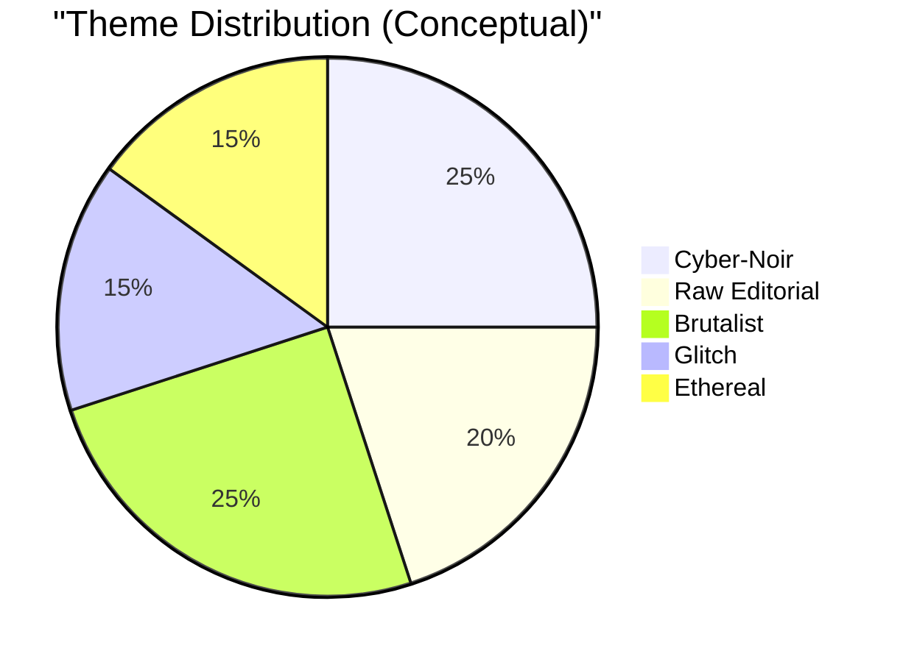
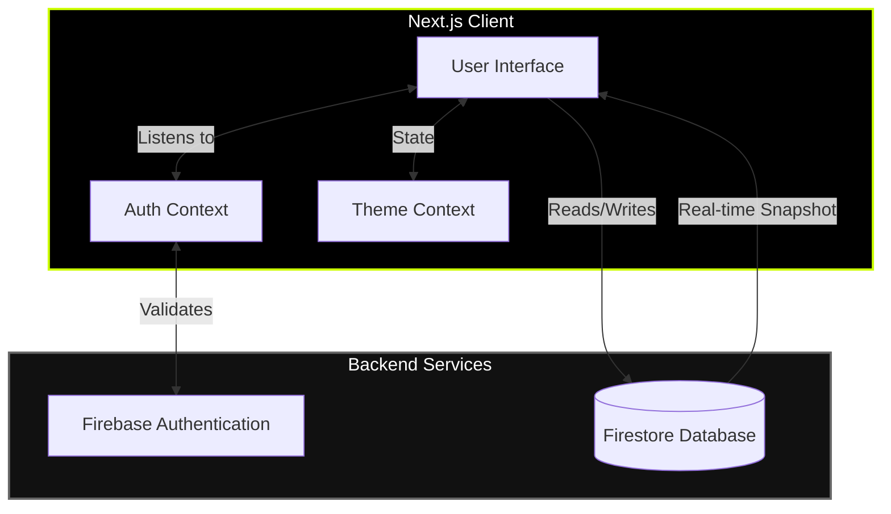

<div align="center">
  
  # 🪩 GRI (GRİ)
  **PREMIUM UNDERGROUND FASHION ARCHIVE**
  
  <p align="center">
    <a href="#features">Features</a> •
    <a href="#aesthetics">Aesthetics</a> •
    <a href="#architecture">Architecture</a> •
    <a href="#getting-started">Getting Started</a>
  </p>
</div>

---

## 👁️ Overview

**Gri** is a premium, state-of-the-art digital fashion archive and curation platform. It serves as a visual telemetry log of underground streetwear, blending high-end fashion aesthetics with bleeding-edge web technology.

The project incorporates multiple aesthetic themes—including Cyber-Noir, Raw Editorial, Brutalist, Glitch, and Ethereal—to create a uniquely dynamic and engaging user experience.

---

## ⚡ Core Features

- **Multi-Theme Architecture**: Seamlessly switch between 5 distinct visual aesthetics.
- **Editorial Feed**: A curated log of fashion telemetry, backed by real-time database updates.
- **Admin Dashboard**: Secure Firebase authentication for content curators to create and manage posts.
- **Smooth Animations**: Integrated `framer-motion` and `lenis` for buttery smooth scrolling and micro-interactions.
- **Glitch & Scanline Effects**: Custom CSS for premium, immersive underground vibes.

---

## 🎨 Aesthetics Engine

Gri utilizes a dynamic theming engine that alters the entire mood of the application.



---

## 🏗️ Architecture & Data Flow

Gri is built on a modern stack leveraging **Next.js (App Router)** and **Firebase**.



---

## 🛠️ Tech Stack

| Category | Technology |
| :--- | :--- |
| **Framework** | Next.js (React 19) |
| **Styling** | Tailwind CSS v4, Custom CSS |
| **Database & Auth** | Firebase (Firestore, Auth) |
| **Animations** | Framer Motion, Lenis (Smooth Scroll) |
| **Icons** | Lucide React |

---

## 🚀 Getting Started

### Prerequisites
- Node.js (v18 or higher)
- npm, yarn, or pnpm
- Firebase Project configured

### Installation

1. **Clone the repository:**
   ```bash
   git clone <repository-url>
   cd gri
   ```

2. **Install dependencies:**
   ```bash
   npm install
   ```

3. **Environment Setup:**
   Create a `.env.local` file in the root directory and add your Firebase configuration:
   ```env
   NEXT_PUBLIC_FIREBASE_API_KEY=your_api_key
   NEXT_PUBLIC_FIREBASE_AUTH_DOMAIN=your_project_id.firebaseapp.com
   NEXT_PUBLIC_FIREBASE_PROJECT_ID=your_project_id
   NEXT_PUBLIC_FIREBASE_STORAGE_BUCKET=your_project_id.appspot.com
   NEXT_PUBLIC_FIREBASE_MESSAGING_SENDER_ID=your_sender_id
   NEXT_PUBLIC_FIREBASE_APP_ID=your_app_id
   ```

4. **Run the development server:**
   ```bash
   npm run dev
   ```

5. **Open your browser:**
   Navigate to [http://localhost:3000](http://localhost:3000) to see the result.

---

<div align="center">
  <p>Built with precision & chaos.</p>
  <p>[ SYS.DIR: /END_OF_FILE ]</p>
</div>
